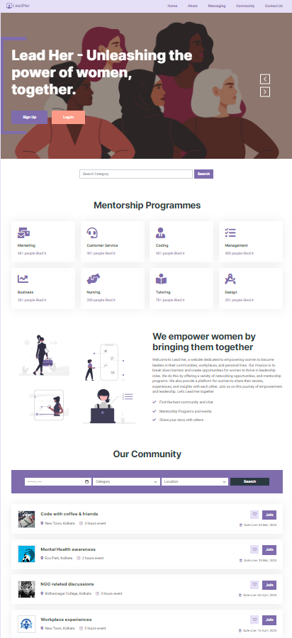

# LeadHer


<!-- PROJECT LOGO -->
<br />
<p align="center">
  <a href="https://github.com/mnaiwrit52/Lead-Her">
    
  </a>

  <h3 align="center">LeadHer-Readme</h3>

  <p align="center">
  Our website is dedicated to empowering women from all walks of life by providing them with the tools and resources they need to achieve their goals and aspirations.   Our communities allow women to connect with like-minded people, share their stories and learn from each other's experiences. We at LeadHer is focused on women    empowerment and community development by offering every women with many Mentorship Programs. Join our community today and start your journey towards empowerment and community development!
  <br />
    <br />
    <a href="https://github.com/mnaiwrit52/Lead-Her"><strong>Explore the docs »</strong></a>
    <br />
    <br />
    <a href="https://lead-her.netlify.app/index.html">View Demo</a>
    

   

  </p>
</p>

<!-- TABLE OF CONTENTS -->
<details open="open">
  <summary><h2 style="display: inline-block">Table of Contents</h2></summary>
  <ol>
    <li>
      <a href="#about-the-project">About The Project</a>
      <ul>
        <li><a href="#built-with">Built With</a></li>
      </ul>
    </li>
    <li>
      <a href="#getting-started">Getting Started</a>
      <ul>
        <li><a href="#prerequisites">Prerequisites</a></li>
        <li><a href="#installation">Installation</a></li>
      </ul>
    </li>
    <li><a href="#contributing">Contributing</a></li>
    <li><a href="#license">License</a></li>
  </ol>
</details>

<!-- ABOUT THE PROJECT -->

## About The Project
<p align="center">
  
  <p/>
<br>Welcome to Lead Her, a website dedicated to empowering women to become leaders in their communities, workplaces, and personal lives. Our mission is to break down barriers and create opportunities for women to thrive in leadership roles. We do this by offering a variety of networking opportunities, and mentorship programs. We also provide a platform for women to share their stories, experiences, and insights with each other. Join us on this journey of empowerment and leadership. Let's Lead Her together

✅Find the best community and chat

✅Mentorship Programs and events

✅Share your story with others

### Built With

- [HTML]()
- [CSS]()
- [BOOTSTRAP]()
- [JAVASCRIPT]()
- [ANDROID STUDIO]()
- [JAVA]()
- [XML]()

<!-- GETTING STARTED -->

## Getting Started

To get a local copy up and running follow these simple steps.

### Prerequisites

- Windows/Linux/Macos operating system
- Git/Github


### Installation

 Clone the repo
   ```sh
   git clone https://github.com/mnaiwrit52/Lead-Her.git
   ```

<!-- CONTRIBUTING -->

## Contributing

Contributions are what make the open source community such an amazing place to be learn, inspire, and create. Any contributions you make are **greatly appreciated**.

1. Fork the Project
2. Create your Feature Branch (`git checkout -b feature/AmazingFeature`)
3. Commit your Changes (`git commit -m 'Add some AmazingFeature'`)
4. Push to the Branch (`git push origin feature/AmazingFeature`)
5. Open a Pull Request

<!-- LICENSE -->

## License

Distributed under the MIT License. See `LICENSE` for more information.

## Made with 💗 by Team Codaholics 


